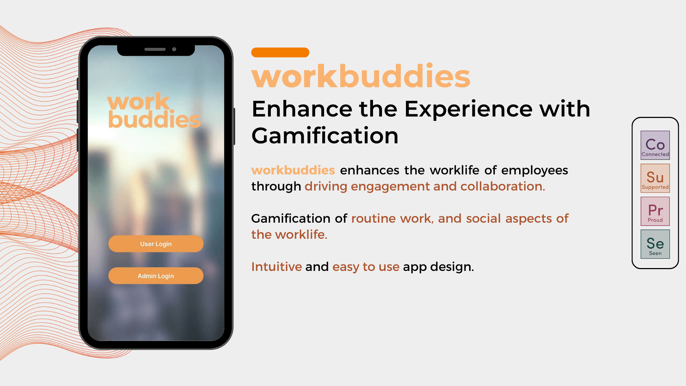

# CodeEXP 2023

Repository for Category 2 Group 8




## Built With

- React Native
- [Expo](https://docs.expo.dev/)
- [NativeBase](https://nativebase.io/)
- Firebase

## Demo Accounts

```
Email: jondoe@gmail.com
Password: 123123

Email: janedou@gmail.com
Password: 123123

Email: accounting@gmail.com
Password: 123123

Email: sales@gmail.com
Password: 123123
```

## Run Locally

First, install packages:

```bash
npm install
```

Run the project:

```bash
npx expo start

# OR

npm run android
npm run ios     # You need to use macOS to build the iOS project
npm run web

```
